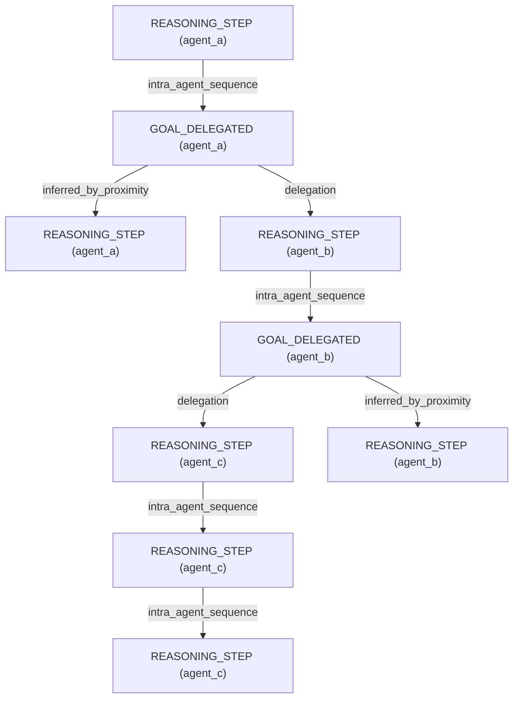

```mermaid
graph TD
    5024a870["GOAL_DELEGATED (agent_a)"]
    eee234b9["REASONING_STEP (agent_a)"]
    5024a870 -->|inferred_by_proximity| eee234b9
    997f6ab8["REASONING_STEP (agent_c)"]
    b837916f["REASONING_STEP (agent_c)"]
    997f6ab8 -->|intra_agent_sequence| b837916f
    49bc24cf["REASONING_STEP (agent_b)"]
    830df0dc["GOAL_DELEGATED (agent_b)"]
    49bc24cf -->|intra_agent_sequence| 830df0dc
    830df0dc["GOAL_DELEGATED (agent_b)"]
    997f6ab8["REASONING_STEP (agent_c)"]
    830df0dc -->|delegation| 997f6ab8
    5024a870["GOAL_DELEGATED (agent_a)"]
    49bc24cf["REASONING_STEP (agent_b)"]
    5024a870 -->|delegation| 49bc24cf
    830df0dc["GOAL_DELEGATED (agent_b)"]
    e6165139["REASONING_STEP (agent_b)"]
    830df0dc -->|inferred_by_proximity| e6165139
    e5d55c0c["REASONING_STEP (agent_a)"]
    5024a870["GOAL_DELEGATED (agent_a)"]
    e5d55c0c -->|intra_agent_sequence| 5024a870
    b837916f["REASONING_STEP (agent_c)"]
    901ec077["REASONING_STEP (agent_c)"]
    b837916f -->|intra_agent_sequence| 901ec077
```