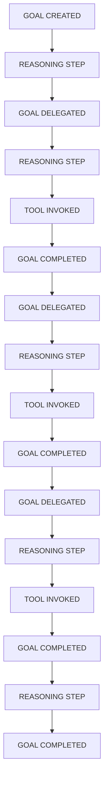

# Causal DAG Visualization

```mermaid
graph TD
    b1439fbf-29ed-43c8-863c-a09de2c9bd1e["GOAL CREATED"] --> 1b95999f-8693-417f-8edb-b5eecb32b12f["REASONING STEP"]
    1b95999f-8693-417f-8edb-b5eecb32b12f["REASONING STEP"] --> 7b4e5b0f-f470-4084-8891-c3ad58690d82["GOAL DELEGATED"]
    7b4e5b0f-f470-4084-8891-c3ad58690d82["GOAL DELEGATED"] --> 05c16978-744a-4726-bb72-bcfdefe459f1["REASONING STEP"]
    05c16978-744a-4726-bb72-bcfdefe459f1["REASONING STEP"] --> 101290ae-e284-4528-a5e1-cb9a25a8b083["TOOL INVOKED"]
    101290ae-e284-4528-a5e1-cb9a25a8b083["TOOL INVOKED"] --> 3a18be0c-790f-49d8-8461-3490ceaeb986["GOAL COMPLETED"]
    3a18be0c-790f-49d8-8461-3490ceaeb986["GOAL COMPLETED"] --> 075ff5f3-9463-4642-8090-c2fccb751204["GOAL DELEGATED"]
    075ff5f3-9463-4642-8090-c2fccb751204["GOAL DELEGATED"] --> 46461b6e-d9ba-4128-bc50-1f696e8f3bb1["REASONING STEP"]
    46461b6e-d9ba-4128-bc50-1f696e8f3bb1["REASONING STEP"] --> feb14702-272a-4301-99cc-c1d0d2fc1f82["TOOL INVOKED"]
    feb14702-272a-4301-99cc-c1d0d2fc1f82["TOOL INVOKED"] --> 5586bb22-40c3-4271-9e2a-a7d00bb88fe2["GOAL COMPLETED"]
    5586bb22-40c3-4271-9e2a-a7d00bb88fe2["GOAL COMPLETED"] --> 060b1c7c-ace0-400d-9328-45adef21a959["GOAL DELEGATED"]
    060b1c7c-ace0-400d-9328-45adef21a959["GOAL DELEGATED"] --> f006ef76-72dc-44c4-9ee7-e8feaad8463c["REASONING STEP"]
    f006ef76-72dc-44c4-9ee7-e8feaad8463c["REASONING STEP"] --> d8b99ab5-3e0b-4686-88a4-4175393223d2["TOOL INVOKED"]
    d8b99ab5-3e0b-4686-88a4-4175393223d2["TOOL INVOKED"] --> 09ddb23b-9d74-4c57-80da-1f16754bcdb5["GOAL COMPLETED"]
    09ddb23b-9d74-4c57-80da-1f16754bcdb5["GOAL COMPLETED"] --> 20b328e1-59f1-4ceb-9fb3-290ec45db292["REASONING STEP"]
    20b328e1-59f1-4ceb-9fb3-290ec45db292["REASONING STEP"] --> b6a48a6d-34ab-44a6-a9c0-a52674ac24a6["GOAL COMPLETED"]
```

