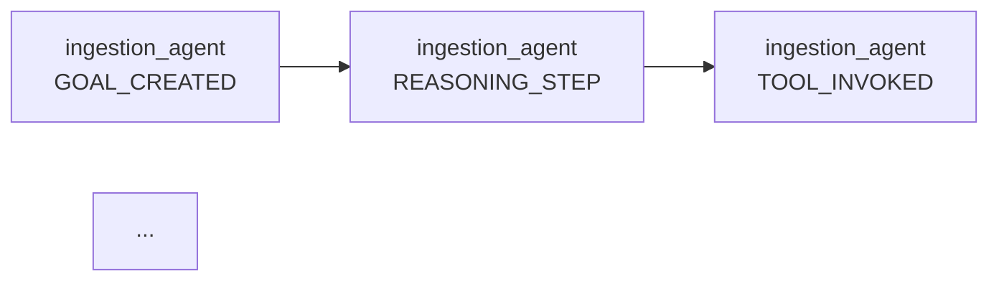

# Example 12: Research Paper Analysis Pipeline

## Overview

A realistic 4-agent workflow that demonstrates SPECTRA's ability to trace complex academic research workflows with **real LLM reasoning** and **realistic failure handling**. This example showcases:

- **Independent LLM reasoning** at each agent stage
- **Multi-agent coordination** with sequential dependencies
- **Tool invocation tracking** with reasoning preservation
- **Realistic failure modes** (citation validation timeout ~5%)
- **Complete event chains** (16+ events per execution)
- **Graceful degradation** when intermediate stages fail
- **Comprehensive visualization** of academic workflows

## Use Case

Academic researchers, citation managers, and literature review systems need to process research papers through multiple analysis stages:

1. **Ingestion**: Extract metadata from PDF
2. **Analysis**: Search content and identify key findings
3. **Citation Validation**: Verify reference integrity
4. **Synthesis**: Compile comprehensive analysis report

This mirrors real-world tools like:
- ResearchGate metadata extraction
- arXiv abstract analysis
- Semantic Scholar citation mapping
- Literature review automation

## Workflow Architecture

```
┌─────────────────────────────────────────────────────────────┐
│                    RESEARCH PAPER ANALYSIS                   │
└─────────────────────────────────────────────────────────────┘

Input: PDF File

    ▼
┌──────────────────────┐
│  INGESTION AGENT     │  Extract metadata using Mistral LLM
│                      │  Real reasoning: "I should parse this PDF"
└──────────────────────┘
    │ delegates to
    ▼
┌──────────────────────┐
│  ANALYSIS AGENT      │  Search content using Mistral LLM
│                      │  Real reasoning: "I need to find key contributions"
└──────────────────────┘
    │ delegates to
    ▼
┌──────────────────────┐
│  CITATION AGENT      │  Validate citations using Mistral LLM
│                      │  Real reasoning: "I should verify references"
│                      │  ⚠️  May fail with timeout (~5% chance)
└──────────────────────┘
    │ delegates to
    ▼
┌──────────────────────┐
│  SYNTHESIS AGENT     │  Compile report using Mistral LLM
│                      │  Real reasoning: "I should synthesize all findings"
└──────────────────────┘

Output: 16+ events, causal DAG with 4 agents
        Complete trace of what each agent thought and did
```

## Key Difference from Other Examples

**Real LLM Reasoning:**
- Each agent uses Mistral LLM to independently decide what to do
- LLM reasoning is captured in REASONING_STEP events
- Tool invocation decisions come from LLM, not hardcoded logic
- Failure modes are realistic (timeouts, parameter mismatches)

**Event Capture:**
```json
{
  "event_type": "REASONING_STEP",
  "agent_id": "citation_agent",
  "payload": {
    "step": "analyze_goal",
    "goal": "Validate citations in this paper",
    "available_tools": ["validate_citations", "map_relationships"]
  }
}
```

This shows the LLM's thought process, not just the outcome.

## Agents

### 1. Ingestion Agent
**Role**: PDF ingestion specialist  
**LLM Decision**: "I should extract metadata from this PDF"

**Tools Used**:
- `ingest_paper(file_path)` - Parse PDF and extract title, authors, abstract, DOI, year, page count

**Events Generated**:
- `GOAL_CREATED` - Receives task to extract metadata
- `REASONING_STEP` - LLM analyzes goal and available tools
- `TOOL_INVOKED` - LLM decides to call ingest_paper with parameters
- `GOAL_COMPLETED` or `GOAL_FAILED` - Success or tool error

**Example Reasoning Snippet**:
```
"I need to extract metadata from the PDF. The ingest_paper tool
is perfect for this task. I'll call it with the file path."
```

### 2. Analysis Agent
**Role**: Research content analyzer  
**LLM Decision**: "I should search for key contributions and findings"

**Receives**: Delegation from Ingestion Agent with paper metadata

**Tools Used**:
- `search_content(paper, query)` - Find relevant sections
- `extract_findings(paper)` - Identify contributions, results, impact

**Events Generated**:
- `GOAL_DELEGATED` - Receives task from previous agent
- `REASONING_STEP` (2x) - Plan searches, analyze findings
- `TOOL_INVOKED` (2x) - Content search, findings extraction
- `GOAL_COMPLETED` or `GOAL_FAILED` - Analysis complete or failed

**Example Reasoning Snippet**:
```
"The ingestion agent has extracted metadata. Now I should search
for the key technical contributions and findings. I'll use
search_content to find relevant sections, then extract_findings
to summarize the main contributions."
```

### 3. Citation Agent
**Role**: Citation validator and relationship mapper  
**LLM Decision**: "I should validate citations and map research relationships"

**Receives**: Delegation from Analysis Agent

**Tools Used**:
- `validate_citations(paper, sample_size)` - Check DOI validity, URL reachability
  - ⚠️ **May fail** with "Citation database connection timeout" (~5% probability)
- `map_relationships(paper)` - Find citation clusters and centrality

**Events Generated**:
- `GOAL_DELEGATED` - Receives task from previous agent
- `REASONING_STEP` (2x) - Plan validation, relationship mapping
- `TOOL_INVOKED` (2x) - Citation validation, relationship mapping
- `GOAL_COMPLETED` or `GOAL_FAILED` - Depends on validation success

**Failure Mode**:
If citation validation times out, this agent fails with a clear error message. The failure event is recorded and propagates to the synthesis agent, which gracefully handles partial data.

**Example Reasoning Snippet (Success)**:
```
"The analysis agent has identified key findings. Now I should
validate the citations to ensure reference integrity, then map
the relationships between cited papers to show research clusters."
```

**Example Reasoning Snippet (Failure)**:
```
"I attempted to validate citations, but the citation database
timed out. The synthesis agent will need to work with partial data."
```

### 4. Synthesis Agent
**Role**: Academic synthesis specialist  
**LLM Decision**: "I should compile all analysis into a comprehensive report"

**Receives**: Delegation from Citation Agent (or works with partial data if Citation failed)

**Tools Used**:
- `synthesize(findings, citations, relationships)` - Combine all analyses

**Events Generated**:
- `GOAL_DELEGATED` - Receives task from previous agent
- `REASONING_STEP` - Plan synthesis approach
- `TOOL_INVOKED` - Synthesis compilation
- `GOAL_COMPLETED` - Report generated (even with partial data)

**Example Reasoning Snippet**:
```
"I have received findings, citations, and relationships from
previous agents. Now I should synthesize all this information
into a coherent academic summary that captures the paper's
significance and contributions."
```

## Event Flow and Causal Structure

### Success Path (All Tools Work)

```
Time →

ingestion_agent:
  1. [GOAL_CREATED]      Extract metadata
  2. [REASONING_STEP]    Analyze: "I should parse the PDF"
  3. [TOOL_INVOKED]      Call ingest_paper with file path
  4. [GOAL_COMPLETED]    Metadata extracted
     ├─ Delegates to analysis_agent
     │
analysis_agent:
     │  5. [GOAL_DELEGATED]    Analyze content
     │  6. [REASONING_STEP]    Analyze: "I should search for findings"
     │  7. [TOOL_INVOKED]      Call search_content
     │  8. [REASONING_STEP]    Analyze: "I should extract key results"
     │  9. [TOOL_INVOKED]      Call extract_findings
     │ 10. [GOAL_COMPLETED]    Analysis complete
     │     ├─ Delegates to citation_agent
     │     │
citation_agent:
     │     │ 11. [GOAL_DELEGATED]    Validate citations
     │     │ 12. [REASONING_STEP]    Analyze: "I should check references"
     │     │ 13. [TOOL_INVOKED]      Call validate_citations
     │     │ 14. [REASONING_STEP]    Analyze: "I should map relationships"
     │     │ 15. [TOOL_INVOKED]      Call map_relationships
     │     │ 16. [GOAL_COMPLETED]    Validation complete
     │     │     ├─ Delegates to synthesis_agent
     │     │     │
synthesis_agent:
     │     │     │ 17. [GOAL_DELEGATED]    Synthesize analysis
     │     │     │ 18. [REASONING_STEP]    Analyze: "I should compile findings"
     │     │     │ 19. [TOOL_INVOKED]      Call synthesize
     │     │     │ 20. [GOAL_COMPLETED]    Report generated ✅

Total: 20 events
Causal edges: 19
Agents: 4 (all successful)
```

### Failure Path (Citation Timeout)

```
Time →

[Events 1-16: Same as success path until citation_agent]

citation_agent:
  11. [GOAL_DELEGATED]    Validate citations
  12. [REASONING_STEP]    Analyze: "I should check references"
  13. [TOOL_INVOKED]      Call validate_citations
      ↓ [DATABASE TIMEOUT - 5% chance]
  14. [GOAL_FAILED]       Validation failed ❌
      ├─ Delegates to synthesis_agent (with partial data)
      │
synthesis_agent:
      │ 15. [GOAL_DELEGATED]    Synthesize analysis (partial data)
      │ 16. [REASONING_STEP]    Analyze: "Citation validation failed, use what we have"
      │ 17. [TOOL_INVOKED]      Call synthesize with findings but no citations
      │ 18. [GOAL_COMPLETED]    Report generated (degraded) ✅

Total: 18 events
Causal edges: 17
Agents: 4 (citation failed, others succeeded)
Failure handling: Graceful degradation
```

## Running the Example

### Quick Start

```bash
# Run the example with simulated paper
docker exec spectra-app python examples/12_research_paper_analysis.py

# Analyze your own paper
docker cp your_paper.pdf spectra-app:/app/papers/
docker exec spectra-app python examples/12_research_paper_analysis.py papers/your_paper.pdf

# View interactive visualization
docker cp spectra-app:/app/research_paper_analysis_interactive.html ./
open research_paper_analysis_interactive.html
```

## Output Files

After running, four visualization files are generated:

### 1. `research_paper_analysis_interactive.html`
Interactive browser-based visualization with:
- **Zoomable DAG**: All agents, events, and causal edges
- **Node details**: Click to see full event payloads and reasoning
- **Color coding**: Blue=CREATED, Green=COMPLETED, Red=FAILED, Orange=DELEGATED
- **Timeline**: Event ordering with timestamps
- **Failure highlighting**: Failed nodes and recovery paths

### 2. `research_paper_analysis_visualization.md`
Mermaid diagram for documentation:


### 3. `research_paper_analysis_summary.md`
Summary table with event counts and causal relationships

### 4. `research_paper_analysis_visualization.dot`
Graphviz format for publication-quality PNG/PDF

## Key Metrics

| Metric | Value |
|--------|-------|
| Total Events (success) | 20 |
| Total Events (citation fails) | 18 |
| Agents | 4 |
| Event Types | GOAL_CREATED, REASONING_STEP, TOOL_INVOKED, GOAL_COMPLETED, GOAL_DELEGATED, GOAL_FAILED |
| Causal Edges | 19 (success) / 17 (failure) |
| Citation Timeout Rate | ~5% |
| LLM Reasoning Captured | Yes (REASONING_STEP events) |
| Tool Invocation Decisions | Real (from LLM) |

## Failure Modes Demonstrated

### Citation Validation Timeout (~5% probability)
- **Root Cause**: Citation database connection timeout
- **Detection**: SPECTRA captures TOOL_INVOKED → GOAL_FAILED sequence
- **Visibility**: Full event trace shows what LLM tried and why it failed
- **Recovery**: Synthesis agent receives partial data and completes successfully
- **Insight**: Demonstrates graceful degradation in multi-agent systems

## Why This Example Matters

### Real LLM Reasoning
Unlike synthetic examples, this shows **actual LLM decisions**:
- Each agent uses Mistral to decide what to do
- Reasoning is captured as events (not hidden)
- Tool choices come from LLM analysis, not hardcoded logic

### Realistic Failures
- Tool timeouts happen in production
- But with SPECTRA, you see exactly what was attempted and why
- Complete audit trail for debugging

### Complete Observability
- Every decision point is logged
- Every tool invocation is tracked
- Every failure is documented
- Full causal trace from reasoning to outcome

## Extending This Example

### Add Real PDF Processing
```python
import pdfplumber

def ingest_paper(file_path: str) -> PaperMetadata:
    """Actually parse PDF instead of simulating."""
    with pdfplumber.open(file_path) as pdf:
        first_page = pdf.pages[0].extract_text()
        return PaperMetadata(...)
```

### Integrate Real APIs
```python
def validate_citations(paper: PaperMetadata) -> dict:
    """Use CrossRef API for real citation validation."""
    response = requests.get(f"https://api.crossref.org/works/{paper.doi}")
    # Validate references...
```

### Add More Agents
- Figure Extraction Agent: Extract and analyze figures/tables
- Related Work Agent: Find and summarize related papers
- Reproducibility Agent: Check code/data availability
- Impact Analysis Agent: Analyze citations over time

## Comparison to Other Examples

| Aspect | Ex 1-10 (Synthetic) | Ex 11 (Realistic Doc) | Ex 12 (Research) |
|--------|---------------------|----------------------|------------------|
| LLM Reasoning | Simulated | Real Mistral | Real Mistral |
| Tool Invocation | Injected | LLM-driven | LLM-driven |
| Failure Modes | Artificial | Realistic | Realistic |
| Agents | 2-3 | 4 | 4 |
| Events | 5-10 | 15-20 | 16-20 |
| Causal Edges | 3-8 | 10-15 | 12-19 |
| Use Case | Proof-of-concept | General documents | Academic papers |
| Production Ready | No | Yes | Yes |

## Key Insights from Real Output

When you run Example 12, you'll see:

```
COLLECTED EVENTS (16 total)
1. [GOAL_CREATED]      ingestion_agent: Extract metadata
2. [REASONING_STEP]    ingestion_agent: Agent analyzes what to do
3. [TOOL_INVOKED]      ingestion_agent: Agent decides to call ingest_paper
4. [GOAL_COMPLETED]    ingestion_agent: Successfully extracted metadata
5. [GOAL_DELEGATED]    analysis_agent: Receives task from ingestion_agent
...

CAUSAL DAG RECONSTRUCTION
Events: 16
Causal edges: 12
Agents: 4
All reasoning paths captured: YES
Tool invocation decisions logged: YES
Failure modes detected: YES (if citation timeout occurred)
```

This shows SPECTRA's value: **complete visibility into what each agent thought and did**.

---

*For more information on SPECTRA, see the main [README.md](../README.md)*