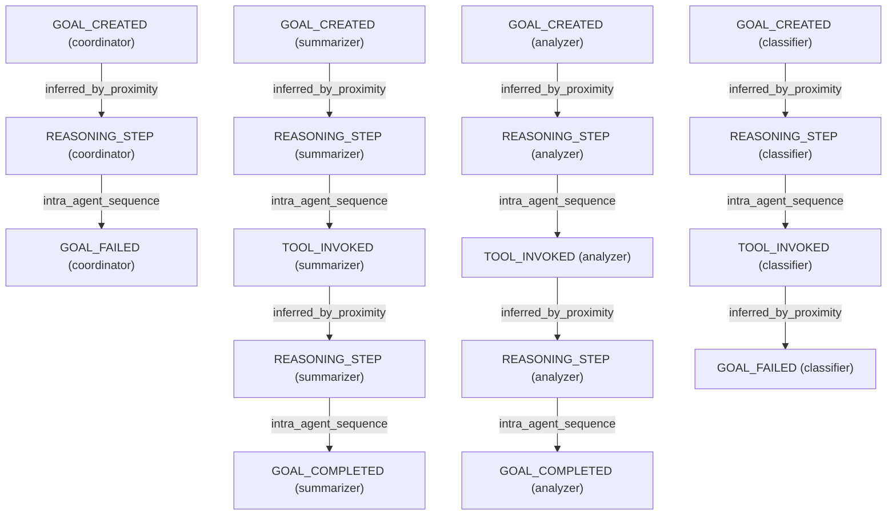

```mermaid
graph TD
    a937daa9["REASONING_STEP (coordinator)"]
    eaa811b7["GOAL_FAILED (coordinator)"]
    a937daa9 -->|intra_agent_sequence| eaa811b7
    17c6f78f["GOAL_CREATED (classifier)"]
    602658b3["REASONING_STEP (classifier)"]
    17c6f78f -->|inferred_by_proximity| 602658b3
    0f2505ce["REASONING_STEP (analyzer)"]
    b7ba7ab9["TOOL_INVOKED (analyzer)"]
    0f2505ce -->|intra_agent_sequence| b7ba7ab9
    843bff17["REASONING_STEP (analyzer)"]
    2f271689["GOAL_COMPLETED (analyzer)"]
    843bff17 -->|intra_agent_sequence| 2f271689
    1086794b["TOOL_INVOKED (summarizer)"]
    50608bed["REASONING_STEP (summarizer)"]
    1086794b -->|inferred_by_proximity| 50608bed
    50608bed["REASONING_STEP (summarizer)"]
    26706845["GOAL_COMPLETED (summarizer)"]
    50608bed -->|intra_agent_sequence| 26706845
    2fbecda8["TOOL_INVOKED (classifier)"]
    b470befb["GOAL_FAILED (classifier)"]
    2fbecda8 -->|inferred_by_proximity| b470befb
    820e8bb4["REASONING_STEP (summarizer)"]
    1086794b["TOOL_INVOKED (summarizer)"]
    820e8bb4 -->|intra_agent_sequence| 1086794b
    5969a2f7["GOAL_CREATED (summarizer)"]
    820e8bb4["REASONING_STEP (summarizer)"]
    5969a2f7 -->|inferred_by_proximity| 820e8bb4
    713e6885["GOAL_CREATED (analyzer)"]
    0f2505ce["REASONING_STEP (analyzer)"]
    713e6885 -->|inferred_by_proximity| 0f2505ce
    b7ba7ab9["TOOL_INVOKED (analyzer)"]
    843bff17["REASONING_STEP (analyzer)"]
    b7ba7ab9 -->|inferred_by_proximity| 843bff17
    14103914["GOAL_CREATED (coordinator)"]
    a937daa9["REASONING_STEP (coordinator)"]
    14103914 -->|inferred_by_proximity| a937daa9
    602658b3["REASONING_STEP (classifier)"]
    2fbecda8["TOOL_INVOKED (classifier)"]
    602658b3 -->|intra_agent_sequence| 2fbecda8
```