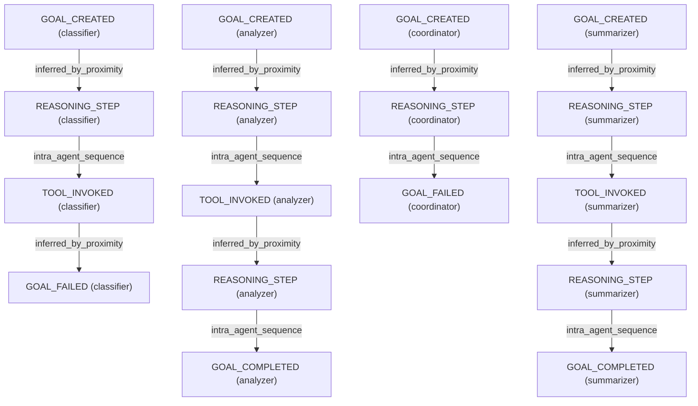

```mermaid
graph TD
    83dcb879["GOAL_CREATED (classifier)"]
    24d02463["REASONING_STEP (classifier)"]
    83dcb879 -->|inferred_by_proximity| 24d02463
    b672063f["TOOL_INVOKED (classifier)"]
    1e4cdf80["GOAL_FAILED (classifier)"]
    b672063f -->|inferred_by_proximity| 1e4cdf80
    a7c1f136["GOAL_CREATED (analyzer)"]
    afcd4e5b["REASONING_STEP (analyzer)"]
    a7c1f136 -->|inferred_by_proximity| afcd4e5b
    49a1a3f2["TOOL_INVOKED (analyzer)"]
    142f4c6e["REASONING_STEP (analyzer)"]
    49a1a3f2 -->|inferred_by_proximity| 142f4c6e
    6be1d010["REASONING_STEP (coordinator)"]
    6d87d8a5["GOAL_FAILED (coordinator)"]
    6be1d010 -->|intra_agent_sequence| 6d87d8a5
    7632f665["REASONING_STEP (summarizer)"]
    1e84ff34["GOAL_COMPLETED (summarizer)"]
    7632f665 -->|intra_agent_sequence| 1e84ff34
    1f7c99b1["TOOL_INVOKED (summarizer)"]
    7632f665["REASONING_STEP (summarizer)"]
    1f7c99b1 -->|inferred_by_proximity| 7632f665
    afcd4e5b["REASONING_STEP (analyzer)"]
    49a1a3f2["TOOL_INVOKED (analyzer)"]
    afcd4e5b -->|intra_agent_sequence| 49a1a3f2
    142f4c6e["REASONING_STEP (analyzer)"]
    755a4578["GOAL_COMPLETED (analyzer)"]
    142f4c6e -->|intra_agent_sequence| 755a4578
    24d02463["REASONING_STEP (classifier)"]
    b672063f["TOOL_INVOKED (classifier)"]
    24d02463 -->|intra_agent_sequence| b672063f
    3e23ae2d["GOAL_CREATED (summarizer)"]
    bcf38584["REASONING_STEP (summarizer)"]
    3e23ae2d -->|inferred_by_proximity| bcf38584
    bcf38584["REASONING_STEP (summarizer)"]
    1f7c99b1["TOOL_INVOKED (summarizer)"]
    bcf38584 -->|intra_agent_sequence| 1f7c99b1
    7ba38261["GOAL_CREATED (coordinator)"]
    6be1d010["REASONING_STEP (coordinator)"]
    7ba38261 -->|inferred_by_proximity| 6be1d010
```