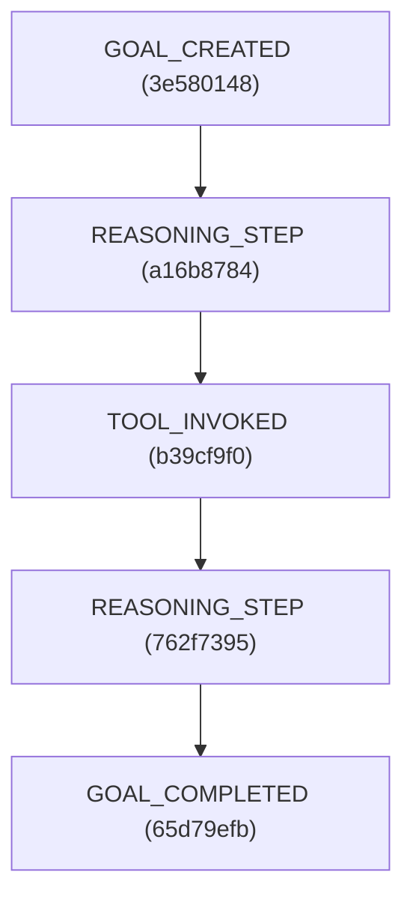
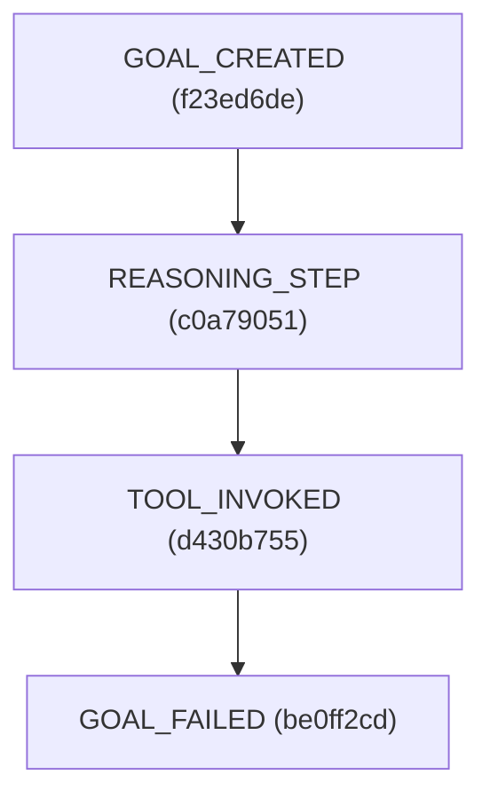
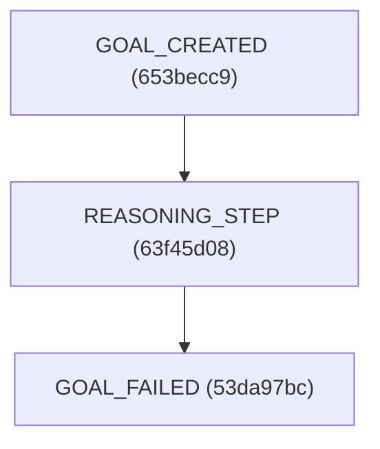
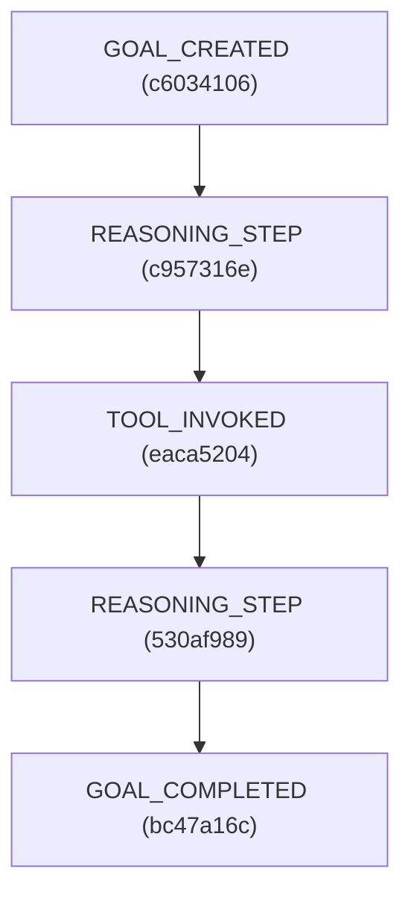

## Agent: analyzer

```mermaid
graph TD
    3e580148["GOAL_CREATED (3e580148)"]
    a16b8784["REASONING_STEP (a16b8784)"]
    b39cf9f0["TOOL_INVOKED (b39cf9f0)"]
    762f7395["REASONING_STEP (762f7395)"]
    65d79efb["GOAL_COMPLETED (65d79efb)"]
    762f7395 --> 65d79efb
    a16b8784 --> b39cf9f0
    3e580148 --> a16b8784
    b39cf9f0 --> 762f7395
```

## Agent: classifier

```mermaid
graph TD
    f23ed6de["GOAL_CREATED (f23ed6de)"]
    c0a79051["REASONING_STEP (c0a79051)"]
    d430b755["TOOL_INVOKED (d430b755)"]
    be0ff2cd["GOAL_FAILED (be0ff2cd)"]
    f23ed6de --> c0a79051
    d430b755 --> be0ff2cd
    c0a79051 --> d430b755
```

## Agent: coordinator

```mermaid
graph TD
    653becc9["GOAL_CREATED (653becc9)"]
    63f45d08["REASONING_STEP (63f45d08)"]
    53da97bc["GOAL_FAILED (53da97bc)"]
    653becc9 --> 63f45d08
    63f45d08 --> 53da97bc
```

## Agent: summarizer

```mermaid
graph TD
    c6034106["GOAL_CREATED (c6034106)"]
    c957316e["REASONING_STEP (c957316e)"]
    eaca5204["TOOL_INVOKED (eaca5204)"]
    530af989["REASONING_STEP (530af989)"]
    bc47a16c["GOAL_COMPLETED (bc47a16c)"]
    c957316e --> eaca5204
    eaca5204 --> 530af989
    c6034106 --> c957316e
    530af989 --> bc47a16c
```
