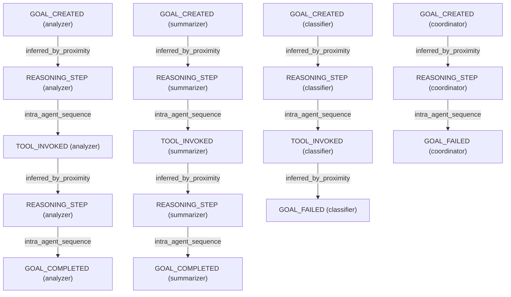

```mermaid
graph TD
    25c952dc["GOAL_CREATED (coordinator)"]
    b86b032d["REASONING_STEP (coordinator)"]
    25c952dc -->|inferred_by_proximity| b86b032d
    0ceb2779["TOOL_INVOKED (summarizer)"]
    0356e671["REASONING_STEP (summarizer)"]
    0ceb2779 -->|inferred_by_proximity| 0356e671
    8d61eeb0["GOAL_CREATED (classifier)"]
    d573cf25["REASONING_STEP (classifier)"]
    8d61eeb0 -->|inferred_by_proximity| d573cf25
    d573cf25["REASONING_STEP (classifier)"]
    e5336976["TOOL_INVOKED (classifier)"]
    d573cf25 -->|intra_agent_sequence| e5336976
    f94db23b["REASONING_STEP (summarizer)"]
    0ceb2779["TOOL_INVOKED (summarizer)"]
    f94db23b -->|intra_agent_sequence| 0ceb2779
    a054011e["REASONING_STEP (analyzer)"]
    c685de26["TOOL_INVOKED (analyzer)"]
    a054011e -->|intra_agent_sequence| c685de26
    ec7bc6ba["GOAL_CREATED (analyzer)"]
    a054011e["REASONING_STEP (analyzer)"]
    ec7bc6ba -->|inferred_by_proximity| a054011e
    c685de26["TOOL_INVOKED (analyzer)"]
    3bcfeee7["REASONING_STEP (analyzer)"]
    c685de26 -->|inferred_by_proximity| 3bcfeee7
    e5336976["TOOL_INVOKED (classifier)"]
    84d71364["GOAL_FAILED (classifier)"]
    e5336976 -->|inferred_by_proximity| 84d71364
    61b12ef6["GOAL_CREATED (summarizer)"]
    f94db23b["REASONING_STEP (summarizer)"]
    61b12ef6 -->|inferred_by_proximity| f94db23b
    0356e671["REASONING_STEP (summarizer)"]
    d6a0a703["GOAL_COMPLETED (summarizer)"]
    0356e671 -->|intra_agent_sequence| d6a0a703
    3bcfeee7["REASONING_STEP (analyzer)"]
    2e194ffc["GOAL_COMPLETED (analyzer)"]
    3bcfeee7 -->|intra_agent_sequence| 2e194ffc
    b86b032d["REASONING_STEP (coordinator)"]
    f1bae972["GOAL_FAILED (coordinator)"]
    b86b032d -->|intra_agent_sequence| f1bae972
```