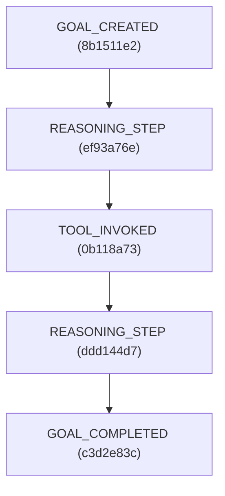
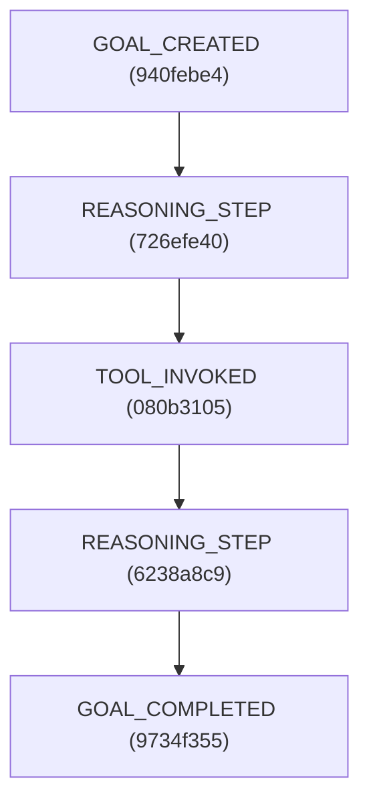
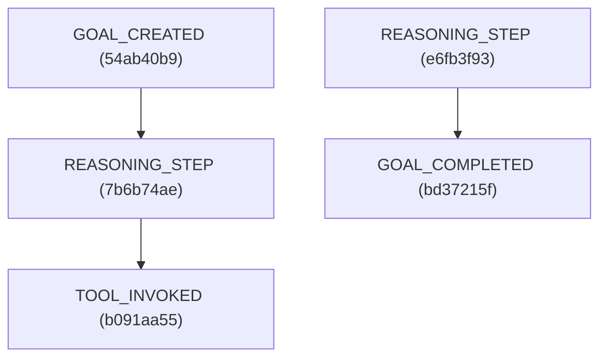
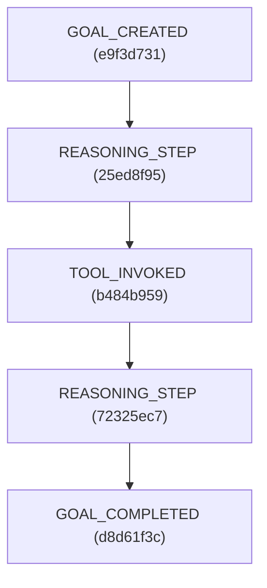

## Agent: analysis_agent

```mermaid
graph TD
    8b1511e2["GOAL_CREATED (8b1511e2)"]
    ef93a76e["REASONING_STEP (ef93a76e)"]
    0b118a73["TOOL_INVOKED (0b118a73)"]
    ddd144d7["REASONING_STEP (ddd144d7)"]
    c3d2e83c["GOAL_COMPLETED (c3d2e83c)"]
    ddd144d7 --> c3d2e83c
    8b1511e2 --> ef93a76e
    0b118a73 --> ddd144d7
    ef93a76e --> 0b118a73
```

## Agent: citation_agent

```mermaid
graph TD
    940febe4["GOAL_CREATED (940febe4)"]
    726efe40["REASONING_STEP (726efe40)"]
    080b3105["TOOL_INVOKED (080b3105)"]
    6238a8c9["REASONING_STEP (6238a8c9)"]
    9734f355["GOAL_COMPLETED (9734f355)"]
    080b3105 --> 6238a8c9
    6238a8c9 --> 9734f355
    726efe40 --> 080b3105
    940febe4 --> 726efe40
```

## Agent: ingestion_agent

```mermaid
graph TD
    54ab40b9["GOAL_CREATED (54ab40b9)"]
    7b6b74ae["REASONING_STEP (7b6b74ae)"]
    b091aa55["TOOL_INVOKED (b091aa55)"]
    e6fb3f93["REASONING_STEP (e6fb3f93)"]
    bd37215f["GOAL_COMPLETED (bd37215f)"]
    54ab40b9 --> 7b6b74ae
    7b6b74ae --> b091aa55
    e6fb3f93 --> bd37215f
```

## Agent: synthesis_agent

```mermaid
graph TD
    e9f3d731["GOAL_CREATED (e9f3d731)"]
    25ed8f95["REASONING_STEP (25ed8f95)"]
    b484b959["TOOL_INVOKED (b484b959)"]
    72325ec7["REASONING_STEP (72325ec7)"]
    d8d61f3c["GOAL_COMPLETED (d8d61f3c)"]
    b484b959 --> 72325ec7
    25ed8f95 --> b484b959
    e9f3d731 --> 25ed8f95
    72325ec7 --> d8d61f3c
```
